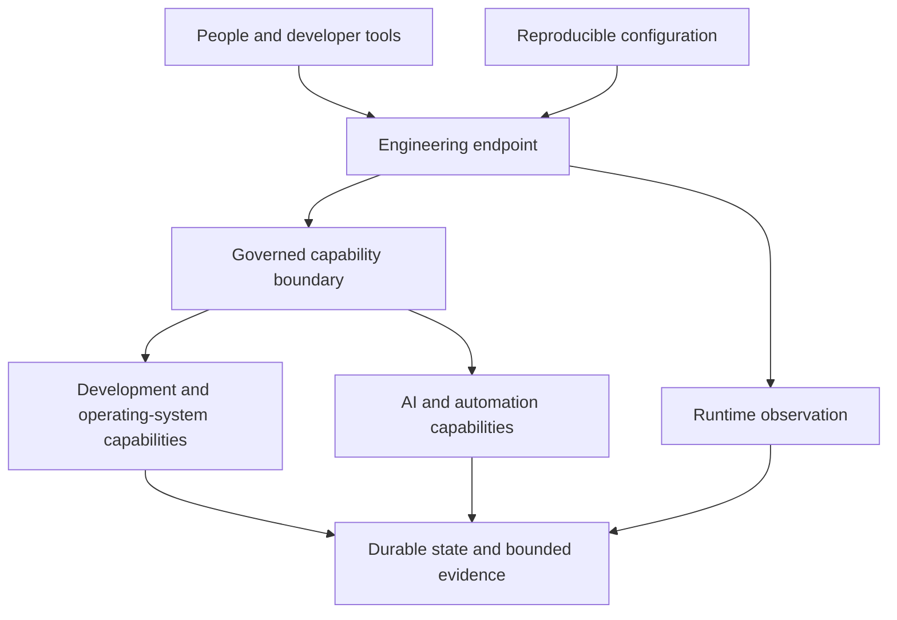

# Conceptual Architecture

Dubnium treats an engineering endpoint as a governed operating environment rather than a collection of unrelated tools.

## Conceptual layers



The diagram communicates responsibilities, not production topology.

- **Reproducible configuration** declares intended system, user, and project inputs.
- **Engineering endpoint** composes only the capabilities required by its deployment form.
- **Governed capability boundary** separates a request from authorization and effect execution.
- **Development and operating-system capabilities** perform bounded engineering work.
- **AI and automation capabilities** may assist reasoning and workflows without inheriting unrestricted authority.
- **Runtime observation** reports what is actually happening rather than assuming intended state succeeded.
- **Durable state and bounded evidence** preserve exact domain state and reviewable outcomes.

## Runtime posture and writable state

Two responsibilities deliberately sit beside declarative configuration rather than inside it:

- [Runtime Operating Modes](runtime-modes.md) choose which already-declared workload posture should be active now and require post-transition observation before declaring success.
- [Writable User Configuration](writable-configuration.md) gives legitimate mutable preferences and first-run state an explicit ownership boundary instead of encouraging edits to generated configuration.

Neither responsibility changes the authority model: a runtime mode cannot install or authorize a missing capability, and writable user configuration cannot redefine privileged host policy.

## Source-of-truth hierarchy

Different questions have different authorities:

```text
declarative intent       -> versioned configuration
observed runtime state   -> operating-system/runtime observation
durable domain state     -> workflow and operation stores
event evidence           -> bounded logs and events
derived understanding    -> reports, dashboards, and journals
```

A dashboard does not become runtime truth. A log does not become authorization. A previous successful operation does not grant authority for a future one.

## Endpoint and central responsibilities

A Dubnium endpoint should remain locally inspectable. Optional central services may aggregate posture, provide shared resources, or coordinate policy, but central state should carry freshness and uncertainty rather than overwrite contradictory endpoint facts.

## Technical-overview boundary

The published architecture describes responsibilities, invariants, and observable state relationships. It intentionally omits machine identities, networks, ports/endpoints, exact service placement and wiring, provider selection, resource assignments, data schemas that are not published contracts, policy thresholds, credentials, and privileged recovery procedures.

Those are deployment and implementation concerns rather than requirements for understanding the architecture.