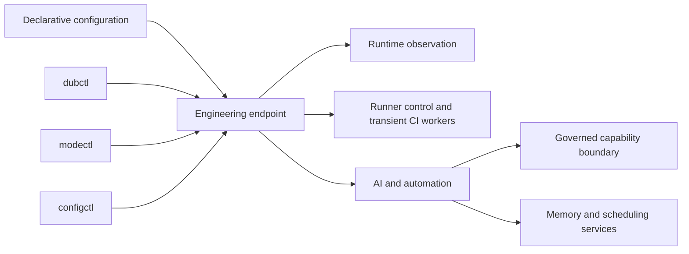

# Components

Dubnium is composed from bounded components rather than one always-on control plane. The important question for each component is not only what it does, but what authority and state it deliberately does **not** own.

Maturity labels describe the current implementation surface, not a compatibility guarantee.

| Component | Responsibility | Maturity |
| --- | --- | --- |
| Declarative platform | Rebuildable operating-system, user-environment, security, and resource-policy inputs | Active |
| `dubctl` | Host/operator entry point for inspection, bounded selections, development workflows, and explicit apply | Active / evolving |
| Runner Controller | Policy-bound self-hosted CI admission, short-lived worker lifecycle, and controller-owned status | Active / evolving |
| `modectl` | Guarded runtime posture transitions between desktop, media, and compute operation | Active |
| `configctl` | Writable user-configuration layers, first-run contracts, and drift/reconciliation beside declarative configuration | Active |
| Capability Gateway | Governed request, authorization, lifecycle, and bounded-effect contract | Experimental; v1 contract |
| Supervisor / LLM Gateway | Bounded model and specialist interface with explicit capability and lineage semantics | Experimental; v1alpha contract |
| Memory Service | Scoped reusable-context and memory interoperability boundary | Experimental; v1alpha contract |
| Scheduler | Scheduled and deferred automation interoperability boundary | Experimental; v1alpha contract |

## Declarative platform

**Purpose.** Define what an endpoint is allowed and able to become from reviewed inputs. NixOS and Home Manager provide the rebuildable system and portable-user layers, while project environments can add project-specific dependencies without turning them into permanent workstation state.

**Boundary.** Declarative configuration is intended state, not proof of current runtime state. It does not replace runtime observation, durable application state, or explicit recovery of mutable data.

**State model.** Versioned configuration describes desired system and user state. A rebuild materializes that intent; runtime observation determines what is actually active afterward.

## `dubctl`

**Purpose.** Provide a coherent operator surface over Dubnium host workflows instead of requiring users to know every underlying Nix or system-service detail.

**Boundary.** `dubctl` is not a second policy engine. Reviewed configuration, registries, profiles, and capability policy remain authoritative. It does not own writable Home configuration, service-specific application data, or secret storage.

**State model.** Read-only commands inspect the endpoint. Mutating commands change only bounded selections or perform an explicit apply of declared configuration.

See [Operator Tooling](operator-tooling.md) for the published responsibility model.

## Runner Controller

**Purpose.** Turn configured self-hosted CI eligibility into admitted short-lived workers only when work exists and local policy permits it. The controller owns admission, transient worker lifecycle, bounded status, and cleanup/reconciliation rather than requiring one permanently running job worker for every configured repository.

**Boundary.** Workflow labels, matrix values, and other job-controlled input do not grant repository, profile, credential, or resource authority. Workers receive only the authority required for one admitted job and do not inherit the controller's long-lived administration credentials.

**State model.** Configuration eligibility, administrative permission, admission, worker execution, completion, and reconciliation are separate states. Configured capacity therefore does not imply that idle job workers must remain active.

See [Operator Tooling](operator-tooling.md) for the public `dubctl runners` surface.

## `modectl`

**Purpose.** Select the runtime posture appropriate to the work happening now without installing new capabilities or rewriting the declarative system definition.

**Boundary.** A mode request cannot grant new authority, bypass capability policy, or silently turn an unavailable capability into an installed one.

**State model.** Desired mode, observed mode, transition guards, reconciliation, and post-transition observation are separate steps. Success requires the observed result to match the requested posture.

See [Runtime Operating Modes](runtime-modes.md).

## `configctl`

**Purpose.** Give applications and users an explicit writable configuration boundary on top of reproducible Nix-managed defaults.

**Boundary.** `configctl` does not turn mutable user configuration into privileged host policy. Secrets, service authority, system security controls, and host-level declarations remain separate concerns.

**State model.** Managed, local, custom, and adopted layers make ownership and promotion explicit instead of relying on undocumented edits to generated files.

See [Writable User Configuration](writable-configuration.md).

## Capability Gateway

**Purpose.** Separate a request for a consequential capability from authorization and effect execution. The contract makes request identity, state, policy decisions, bounded constraints, and resulting evidence explicit.

**Boundary.** Possessing a transport path or producing a valid request does not itself grant authority. The Gateway is not a general service bus and does not make model output, prior success, or network reachability equivalent to permission.

**Maturity.** Experimental. The published v1 contract and conformance assets establish a portable boundary without claiming that every production effect provider is openly implemented.

- [Capability Gateway v1](https://github.com/hackelia-micrantha/dubnium-community/blob/main/spec/capability-gateway-v1.md)
- [Conformance assets](https://github.com/hackelia-micrantha/dubnium-community/tree/main/conformance)

## Supervisor / LLM Gateway

**Purpose.** Expose a bounded interface for model and specialist execution with explicit capability negotiation, normalized errors, sanitized metadata, and execution lineage. The control-plane direction is local-first, with stronger remote or frontier execution treated as an explicit bounded escalation rather than an ambient fallback.

**Boundary.** Model or specialist output is proposal material, not ambient authority to mutate the host, deploy software, write durable memory, train or promote models, or bypass governance. Escalating model capability does not escalate effect authority.

**Maturity.** Experimental v1alpha.

- [Supervisor / LLM Gateway v1alpha](https://github.com/hackelia-micrantha/dubnium-community/blob/main/spec/supervisor-gateway-v1alpha.md)

## Memory Service

**Purpose.** Provide an interoperability boundary for scoped reusable context and memory used by model-assisted and automated workflows.

**Boundary.** Memory is durable application data with scope and governance; it is not authorization, runtime truth, or an implicit channel for privileged effects. Where semantic retrieval is enabled, embeddings and indexes remain derived retrieval state and ranked results remain evidence rather than authority or proof of currentness. Repository, document, and live-runtime sources remain separate source-of-truth boundaries rather than being silently federated through memory.

**Maturity.** Experimental v1alpha.

- [Memory Service v1alpha](https://github.com/hackelia-micrantha/dubnium-community/blob/main/spec/memory-service-v1alpha.md)

## Scheduler

**Purpose.** Represent scheduled and deferred automation through explicit requests and state rather than hidden background behavior.

**Boundary.** Scheduling decides **when** bounded work should be attempted. It does not automatically grant the scheduled task additional authority.

**Maturity.** Experimental v1alpha.

- [Scheduler v1alpha](https://github.com/hackelia-micrantha/dubnium-community/blob/main/spec/scheduler-v1alpha.md)

## Model lifecycle boundary

Model training is an experimental governed capability rather than an extension of inference authority. The durable lifecycle keeps distinct authorities for training execution, resource enforcement, evaluation, promotion, catalog binding, and runtime activation.

```text
reviewed training intent
-> governed training execution
-> candidate artifact
-> independent evaluation
-> promotion decision
-> approved model binding
-> inference runtime
```

Training success does not imply evaluation success, promotion authority, or runtime activation. This separation allows trainer implementations to evolve without making a model or specialist capable of approving its own replacement.

## How the pieces fit



The diagram shows responsibility, not production topology. Published documentation intentionally stops before machine identities, exact service wiring, credentials, resource assignments, policy thresholds, provider-selection heuristics, and privileged operating procedures.
