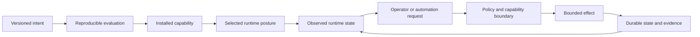

# How Dubnium Works

Dubnium is easiest to understand as a set of boundaries between **declared intent**, **runtime state**, **observation**, and **governed effects**.

The project does not treat configuration, automation, or AI output as equivalent kinds of truth. Each answers a different question and carries different authority.

## End-to-end mental model

The important property is not the exact implementation behind each box. It is that crossing from one responsibility to another is explicit and inspectable.

## 1. Declared intent describes what may exist

NixOS, Home Manager, project environments, and reviewed configuration describe the reproducible inputs of an endpoint. This layer answers questions such as:

- which capabilities are present;
- which services or tools may be available;
- which user-environment defaults are managed;
- which resource and security boundaries are declared.

Declared intent does **not** prove that a service is running, a workload is healthy, or a privileged effect is authorized at this moment.

## 2. Runtime posture selects from already-declared capability

An endpoint may need different operating postures over time. Interactive work, media-priority work, and compute-heavy work can place different demands on the same machine.

A runtime-mode transition selects among capabilities that configuration already permits. It does not install missing capability or create new authority. The transition is only considered successful after the resulting state is observed.

See [Runtime Operating Modes](runtime-modes.md).

## 3. Observation reports what is actually happening

Dubnium keeps intended state and observed state separate. Operator tooling can report service state, runner capacity, runtime posture, configuration ownership, and other bounded facts without pretending that configuration alone proves runtime success.

This separation also prevents telemetry from becoming policy. A log, metric, dashboard, or previous successful run may be useful evidence, but it does not authorize a future effect.

See [Observability and Evidence](observability.md).

## 4. Requests cross explicit authority boundaries

A human, workflow, scheduler, or model may request an action. A request is not permission.

Consequential effects are expected to cross a boundary that can bind identity, capability, policy, lifecycle state, and evidence. A stronger model or richer context can improve a proposal, but it does not widen the caller's effect authority.

This same rule applies to retrieved context: similarity or relevance can help reasoning, but retrieval rank does not establish approval, currentness, or operational truth.

See [Governance and Safety](governance.md) and [AI and Automation](ai-and-automation.md).

## 5. Effects produce state and evidence

A successful operation should leave enough bounded evidence to answer what happened without indiscriminately capturing private source, prompts, credentials, or unrelated activity.

Durable workflow state, domain state, and runtime observation remain distinct. That allows retries, reconciliation, replacement, and audit without reconstructing the world from model context or logs.

## Invariants that hold across the system

Several rules repeat throughout Dubnium:

| Statement | What it prevents |
| --- | --- |
| Declared capability is not observed activity | Configuration being mistaken for runtime truth |
| A request is not authority | Callers authorizing their own effects |
| Observation is not policy | Logs or dashboards silently becoming control planes |
| Retrieval is evidence, not authority | Similarity rank being treated as approval or truth |
| Execution success is not promotion | A candidate artifact activating itself |
| A CLI is not the source of truth | Convenience tooling becoming a second configuration system |

## Local-first, not isolated

Dubnium favors local execution and local inspectability where they are sufficient. Remote services, stronger models, shared compute, or central coordination may still be used through explicit contracts.

The important architectural property is that adding a remote dependency does not erase the endpoint's ability to explain its own declared state, current posture, observed behavior, or authority boundaries.

## What this overview intentionally does not publish

This chapter describes responsibility and behavior, not deployment-sensitive implementation. It intentionally omits exact topology, service-unit wiring, trusted identities, credentials, policy thresholds, routing heuristics, privileged procedures, and production operational evidence.

The public contract is the separation between responsibilities, not the private mechanics used by one deployment to enforce them.
