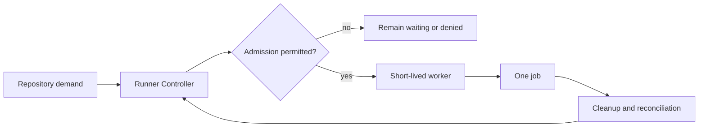

# Self-Hosted CI Runner Controller

Dubnium treats self-hosted CI capacity as a governed runtime resource rather than a collection of permanently waiting runner processes.

The public design goal is simple: **keep controller authority persistent, but make ordinary job execution short-lived and bounded**.

## Responsibility split



The controller owns lifecycle decisions and status. The worker owns one admitted job and then disappears.

## Why not keep ordinary runners permanently idle?

A permanently waiting worker carries more ambient state than Dubnium needs for ordinary CI demand. Short-lived workers reduce the amount of time job execution environments exist and make ownership easier to reason about.

This does not make untrusted CI safe by itself. It provides a clearer lifecycle boundary that can be combined with reviewed repository policy, bounded resources, credential separation, filesystem isolation, and destination-side controls.

## Admission happens before worker creation

A workflow asking for capacity does not get to choose arbitrary authority.

Before ordinary work is admitted, the controller evaluates already-reviewed eligibility and current host state. Publicly relevant inputs include:

- whether the repository is eligible for local execution;
- whether the requested class of work is already declared;
- whether bounded capacity is available;
- whether administrative policy currently permits work;
- whether existing worker ownership can be explained.

Only admitted work receives a worker.

The exact registry, thresholds, credentials, scheduling algorithm, and host-specific resource values are deployment details and are intentionally not published here.

## The worker is intentionally disposable

An admitted worker has a narrow lifecycle:

```text
created
  -> accepts one admitted assignment
  -> executes inside bounded job isolation
  -> reports terminal outcome
  -> cleanup
  -> gone
```

Ordinary workers do not become a durable source of configuration or identity. A future job is admitted again from current policy and current host state.

## Controller credentials do not become job credentials

The controller may need authority to coordinate the runner lifecycle. That authority is not meant to become ambient authority inside the job environment.

This separation is important because the code under test should not inherit control-plane credentials merely because it runs on the same physical endpoint.

The public invariant is credential separation; exact credential material and transport remain private.

## Capacity is a state model, not a process count

Operators should not infer capacity from the number of visible worker processes.

A useful conceptual model is:

```text
configured eligibility
  + administrative permission
  + bounded host capacity
  - currently owned work
  = currently available capacity
```

The implementation may represent additional states, but this distinction explains an important behavior: **zero active workers can be a healthy idle condition**.

Likewise, configured capacity does not imply that idle workers must already exist.

## Canonical observation

The controller exposes bounded status through the operator surface:

```sh
dubctl runners status
dubctl runners status --json
```

The status model is intended to answer questions such as:

- is self-hosted CI administratively permitted;
- what capacity is currently eligible;
- how much admitted work is owned;
- which workers are active;
- whether controller observation is healthy;
- whether reconciliation is required.

Scripts and dashboards should consume the structured state rather than derive lifecycle truth from process lists or logs.

## Reconciliation is explicit

CI state can become stale or partially completed when a process crashes, a job disappears, or cleanup is interrupted. The controller therefore treats reconciliation as a first-class responsibility.

The goal is not to preserve a worker at all costs. The goal is to restore an explainable relationship between admitted work, owned resources, and observed runtime state.

Ambiguous ownership should fail safely rather than guessing that an unknown worker can be reused or deleted.

## Queue priority does not create authority

When multiple already-authorized jobs are waiting for bounded local capacity, ordering may decide which job receives the next available slot.

Priority changes **order**, not eligibility. A lower-level workflow request cannot use queue manipulation to select another repository's profile, stronger credentials, or additional capability.

## Trust boundaries

The runner design preserves several separations:

| Boundary | Public invariant |
| --- | --- |
| Repository demand → admission | Demand does not imply permission |
| Controller → worker | Lifecycle authority is not inherited by job code |
| Worker → host | Job execution is bounded and disposable |
| Queue → policy | Ordering does not widen eligibility |
| Logs → state | Logs are evidence, not lifecycle authority |
| Previous job → next job | Successful execution grants no future authority |

## What is deliberately omitted

This overview does not publish exact repository mappings, runner labels, service wiring, credential flows, filesystem paths, resource thresholds, scheduling heuristics, cleanup implementation, or production incident procedures.

Those details are not required to understand the public contract: reviewed eligibility becomes bounded short-lived execution through an observable controller-owned lifecycle.
